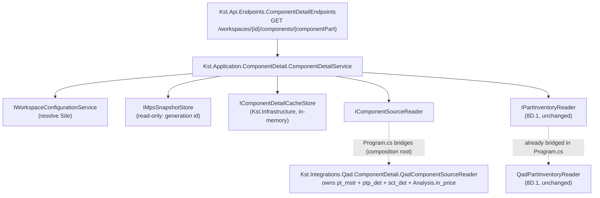

# Stage 8D.5 — Component Info Backend — Plan Pass

> **STATUS: PLANNING ONLY — awaiting owner review.** No production code, tests, generated
> contracts, or OpenAPI were changed. Two read-only live QAD/Analysis queries were run
> (`SELECT`/`INFORMATION_SCHEMA` only) to validate `sct_det` and `Analysis.dbo.in_price`. This
> document is the full deliverable requested by the Stage 8D.5 planning prompt (sections A–P).

---

## A. Repository Baseline

- Branch `main`, HEAD `0467676` — `feat: complete Stage 8D.4 BOM frontend` (== `origin/main`).
- Working tree clean except one pre-existing untracked folder (`docs/reference/security/`, not
  created by this session, left untouched).
- Stages 8D.1 (`bf89c60`), 8D.2 (`624e353`), 8D.3 (`23fe252`), 8D.4 (`0467676`) are all present,
  committed, and pushed.
- Full backend suite re-run this session (build-verified, not merely assumed):
  **579/579 passing** — `Kst.Domain.Tests` 118, `Kst.Integrations.Qad.Tests` 144,
  `Kst.Application.Tests` 210, `Kst.ArchitectureTests` 9, `Kst.Api.IntegrationTests` 98. Build
  regenerated `docs/openapi/Kst.Api.json` byte-identical to the committed copy (confirmed via
  `git status`/`git diff --stat` — no diff).
- Frontend baseline per `KST_v2_STAGE_8D4_BOM_FRONTEND_PLAN.md` (8D.4 closeout note): 196/196 tests,
  typecheck/lint/build clean. Not re-run — no frontend work occurs in 8D.5 and no frontend files
  are touched.
- Existing component/inventory/cache/API patterns inspected: `Kst.Application.Bom.BomService`,
  `Kst.Application.PartDetail.PartDetailService`, `Kst.Application.Inventory.IPartInventoryReader`,
  `Kst.Integrations.Qad.Bom.QadBomReader`, `Kst.Integrations.Qad.PartDetail.QadPartDetailReader`,
  `Kst.Integrations.Qad.Inventory.QadPartInventoryReader`, `InMemoryBomCacheStore`, `Program.cs`
  DI wiring, `BomEndpoints`/`PartDetailEndpoints`, `BomEndpointTests`/`KstApiFactory` override
  pattern, `Kst.ArchitectureTests.DependencyRuleTests`.

## B. Existing Reuse Opportunities

| Capability | Exact existing artifact | Reuse plan |
|---|---|---|
| Shared Site+Part inventory | `Kst.Application.Inventory.IPartInventoryReader` / `DelegatePartInventoryReader`, backed by `Kst.Integrations.Qad.Inventory.QadPartInventoryReader.ReadSummariesAsync` (batch, authoritative zeroes, RMA-excluded, nettable/non-nettable split) | Call `ReadSummariesAsync(site, [componentPart])` from the new `ComponentDetailService` directly — **no new inventory SQL**, matching the accepted 8D.1 contract already reused as-is by `BomService`. |
| Reader/delegate bridge pattern | `IBomSourceReader`/`DelegateBomSourceReader`, `IPartDetailSourceReader`/`DelegatePartDetailSourceReader`, wired in `Program.cs` only when `qadOptions.IsConfigured`, else a delegate that throws `InvalidOperationException("QAD connection is not configured.")` | New `IComponentSourceReader`/`DelegateComponentSourceReader` in `Kst.Application`, concrete `QadComponentSourceReader` in `Kst.Integrations.Qad`, wired identically in `Program.cs`. |
| Cache pattern | `IBomCacheStore`/`InMemoryBomCacheStore` (keyed `(WorkspaceId, ParentPart)`, entry carries `Site`/`EffectiveDate`/`LoadedAgainstMpsSnapshotId` compatibility fields enforced by the **service**, not the store) | New `IComponentDetailCacheStore`/`InMemoryComponentDetailCacheStore` keyed `(WorkspaceId, ComponentPart)`, entry carries `Site` + `LoadedAgainstMpsSnapshotId` (no `EffectiveDate` — see §E/§H, Component Info has no effective-date concept). |
| Workspace/snapshot lookup | `BomService`/`PartDetailService` both resolve `workspace.Site` via `IWorkspaceConfigurationService.GetWorkspacesAsync()` then read (never mutate) `IMpsSnapshotStore.GetState(workspaceId)` | Identical pattern in `ComponentDetailService`. |
| Problem Details pattern | Endpoint-local `Results.Problem(title:, detail:, statusCode:)` switch expressions in `BomEndpoints`/`PartDetailEndpoints`, no shared factory | New `ComponentDetailEndpoints` follows the same inline switch-expression style. |
| API integration-test override | `KstApiFactory` DI override + `IMpsSnapshotStore.SetLoaded(...)` seeding, e.g. `BomEndpointTests.SeedMps` | New `ComponentDetailEndpointTests` follows the identical `FakeXxxReader` + `KstApiFactory` override pattern used by `BomEndpointTests`. |
| Part Status description | `Kst.Domain.PartDetail.PartStatusMap.Describe(code)` | Reuse directly for Component Info's Part Status description — do not duplicate the code→description table. |
| Null-safe description | `QadBomReader.CombineDescription(desc1, desc2)` (trim, drop blank, join with one space) | Reuse the **same convention** (not necessarily the same static method — it is `internal` to the BOM reader today; the new component reader implements an equivalent pure helper) per the plan's explicit "same null-safe description convention already accepted for BOM/part display" instruction. |
| P/M fallback | `QadBomReader.ResolveEffectivePmCode` | **Not reused** — Component Info has no P/M field in its accepted §3 field list; do not add one. |

No existing reusable "master part reader" beyond `QadPartDetailReader`'s inline part-master query
was found, and it has different semantics (site LEFT JOIN uses different field subset, folds
inventory/price in) — not the same grain/meaning as what Component Info needs (master + full
site-planning field set + cost + QCTC, no price tiers). Building a new, narrowly-scoped
`QadComponentSourceReader` is the smallest correct choice; nothing is duplicated that already
serves this exact purpose.

## C. Live Source Validation — `sct_det`

All queries were `SELECT`/`INFORMATION_SCHEMA` only, executed against the real dev environment
(`KNWVM13`/`QADPRO2`, Windows-integrated auth, `READ UNCOMMITTED`, matching `QadConnectionFactory`
convention). No data was modified.

**Table access:** confirmed. `INFORMATION_SCHEMA.TABLES` shows `QADPro2.dbo.sct_det`.

**Exact columns/types relevant to Component Info** (`INFORMATION_SCHEMA.COLUMNS`):

| Column | Type | Nullable |
|---|---|---|
| `sct_domain` | `nvarchar(8)` | YES |
| `sct_site` | `nvarchar(80)` | YES |
| `sct_part` | `nvarchar(30)` | YES |
| `sct_sim` | `nvarchar(80)` | YES |
| `sct_cst_tot` | `decimal(28,10)` | YES |
| `sct_cst_date` | `datetime` | YES |
| `oid_sct_det` | `decimal(28,10)` | YES |

**🔴 Critical finding — `sct_sim` is a cost-simulation dimension not present in the accepted
mapping.** `sct_det` is **not** one row-per-latest-date per (domain, site, part). It carries a
`sct_sim` column identifying a **cost simulation/scenario set**. Distinct values observed for
KTC/SW (row counts): `Standard` 297,434 · `Current` 296,340 · `2027KPI` 184,520 · `2025KPI` 88,161
· `2026KPI` 87,266 · `PurCst` 2. (Casing is inconsistent — `'Standard'` and `'standard'` both
appear; SQL Server's default collation groups them case-insensitively, consistent with every other
QAD text comparison already in this codebase.)

Representative data for the validated BOM (Site SW, domain KTC, parent `00-00013761-00`, several
components) show **each simulation carries its own, independent `sct_cst_date`** — e.g. part
`155610`: `Standard` @ 2026-05-16 (0.6437793799, `sct_rollup=1`), `Current` @ 2026-05-27
(0.6415582407), `2027KPI` @ 2026-07-07 (0.6437793799). Picking `MAX(sct_cst_date)` **across all
simulations mixed together** would sometimes select a `Current` or `*KPI` row instead of the
literal "Standard Cost" — in this sample it happens that `Standard` carries the latest date for
every part checked (uniformly `2026-08-15`, i.e. all parts' Standard-cost rolls were computed on
one shared batch date), but **that is a data coincidence, not a schema guarantee**, and the
accepted written mapping ("§6.4 latest `sct_cst_date`") never mentions filtering by `sct_sim` at
all.

**Resolving evidence — uniqueness once filtered to `sct_sim = 'Standard'`:** for **every** part
checked at KTC/SW there is **exactly one** `sct_sim = 'Standard'` row (verified with a
`GROUP BY sct_part HAVING COUNT(*) > 1` query — zero results). Coverage: 297,434 of 297,448
distinct KTC/SW parts have a `Standard`-sim row (99.995% — the remainder is valid partial data, not
an error). **Filtering `sct_sim = 'Standard'` before any date logic removes the entire tie/mixing
problem** — the field literally named "Standard Cost" almost certainly means `sct_sim = 'Standard'`
directly, not "whatever simulation happens to be dated latest."

**No same-date ties exist within `sct_sim = 'Standard'`** (there is nothing to tie-break — it is
naturally 1 row per part). This is reported as strong evidence, not silently adopted; see §O for
the exact owner decision needed (the written contract must be amended to add the `sct_sim` filter,
which is a real, material change from the literal "§6.4 latest `sct_cst_date`" text).

## D. Live Source Validation — `Analysis.dbo.in_price`

**Access:** confirmed successful using the **existing** QAD connection/security context — no new
connection string, project, or credentials were needed. The same `SqlConnection` opened against
`KNWVM13`/`QADPRO2` (Windows-integrated auth) can query the three-part name
`Analysis.dbo.in_price` directly (cross-database query on the same SQL Server instance). This
resolves §13's open question: QCTC access requires **no new integration project or connection
model** — it belongs in `Kst.Integrations.Qad` alongside `sct_det`/`pt_mstr`/`ptp_det`, using the
same `QadConnectionFactory`/`QadConnectionOptions`.

**Exact columns/types** (`Analysis.INFORMATION_SCHEMA.COLUMNS`):

| Column | Type | Nullable |
|---|---|---|
| `inp_domain` | `varchar(50)` | NO |
| `inp_site` | `varchar(50)` | NO |
| `inp_part` | `varchar(50)` | NO |
| `inp_list_id` | `varchar(50)` | NO |
| `inp_rank` | `int` | NO |
| `inp_source` | `varchar(50)` | NO |
| `inp_start_date` | `datetime` | NO |
| `inp_qctc` | `decimal(18,5)` | NO |
| `inp_custprice` | `decimal(18,5)` | NO |

**🔴 Critical finding — `in_price` is a union of at least three source feeds, distinguished by
`inp_source`, and QCTC is only meaningful for one of them.** Observed `inp_source` values for
KTC/SW with `inp_qctc <> 0` counts: `idh_hist` 12,060 rows / **0** non-zero QCTC · `pid_det` 17,464
rows / **0** non-zero QCTC · `qtbom_det` 28,174 rows / **28,156** non-zero QCTC. In other words,
`idh_hist` (price history) and `pid_det` (the same price-tier table Stage 6 `PartDetail` already
reads) rows **structurally never carry a QCTC value** in this environment — every single one of
their ~29,500 combined rows is `inp_qctc = 0.00000`. Real component `ZARI-30168900` demonstrates
the concrete danger directly: it has a `pid_det`-sourced row and a `qtbom_det`-sourced row sharing
the **identical** `(inp_domain, inp_site, inp_part, inp_start_date, inp_list_id, inp_rank)` tuple
(`4/21/2023`, list `203416`, rank `1`) — the `pid_det` row reports `inp_qctc = 0`, the `qtbom_det`
row reports `inp_qctc = 0.82244`. **Ordering by `inp_start_date DESC` alone, without also
constraining `inp_source`, is genuinely ambiguous** (SQL Server does not guarantee which of two
equally-latest rows a bare `ORDER BY ... TOP (1)` returns) and can silently report a false `$0.00`
QCTC when a real quoted cost exists in the very same table.

**Resolving evidence — restricting to `inp_source = 'qtbom_det'` removes the ambiguity entirely.**
Within KTC/SW, filtering to `inp_source = 'qtbom_det'` first: (a) is the only source where
`inp_qctc` is ever non-zero (matches the literal "Quoted Cost"/QCTC business meaning), and (b) has
**zero** `(domain, site, part, start_date)` duplicates — verified via
`GROUP BY ... HAVING COUNT(*) > 1` returning no rows. Every part checked in this source also had
exactly **one** `qtbom_det` row total (no historical multiple-dates were observed for any part in
this sample), so "latest `inp_start_date`" is a defensive rule for future data rather than
something the current data exercises.

**No future-dated rows currently exist** in either source for KTC/SW (`qtbom_det` max
`inp_start_date` = 2026-08-17; `sct_det` `Standard`-sim max `sct_cst_date` = 2026-08-21; current
date 2026-08-21) — so a `<= today` bound (as Stage 6 pricing uses for `pi_start`) would currently
produce an identical result to an unbounded `MAX(...)`. The written §6.5 mapping does not ask for
a `<= today` bound; this plan does not add one, but flags the difference from the Stage 6 pricing
convention as a minor, currently-inert risk (see §O).

Representative live values gathered (Site SW / domain KTC), used for §23 future live validation:

| Component | P/M | `ptp_det` @ SW | Net QOH | Standard cost (`sct_sim='Standard'`) | QCTC (`qtbom_det`) |
|---|---|---|---|---|---|
| `100191` | P | present (`ptp_buyer=3001`, cum lead 63d) | 7,917.1995 | 0.2868320000 (2026-08-15) | 0.25900 (2025-12-31) |
| `61281-7` | P | present | — | 0.0066080000 (2026-08-15) | 0.00414 (2016-06-10) |
| `155610` | M | **none at SW** (all fields blank) | 0 / 0 | 0.6437793799 (2026-05-16, `sct_rollup=1`) | — |
| `105186-1` | M | present (`ptp_buyer=PH19F`, IOS `HIP`) | 0 / 0 | — | — |
| `98658-1` | M | present (`ptp_buyer=PH19F`, IOS `KIN`) | 0 / 0 | — | — |

This satisfies §8's request for a representative set (P, M, nonzero inventory, zero inventory,
present `ptp_det`, missing `ptp_det`, nonzero Standard Cost, nonzero QCTC) using real BOM
components from the accepted Site SW / parent `00-00013761-00` tree (93 distinct components
recursively).

## E. Accepted Source Map

| API Field | Source | Grain | Missing-data behavior | Notes |
|---|---|---|---|---|
| Component Item | `pt_mstr.pt_part` | Domain + Part | n/a (identity) | |
| Description | `pt_mstr.pt_desc1`/`pt_desc2` | Domain + Part | null if both blank | Null-safe combine (trim, drop blank, join with one space) — same convention as `QadBomReader.CombineDescription`. |
| Part Status | `pt_mstr.pt_status` (+ `PartStatusMap.Describe`) | Domain + Part | null if `pt_status` null | Reuse `Kst.Domain.PartDetail.PartStatusMap` verbatim. |
| IOS | `pt_mstr.pt_warr_cd` | Domain + Part | null | |
| Net QOH | Shared `IPartInventoryReader` (`ld_det`/`loc_mstr`/`is_mstr`, positive-only, RMA-excluded, nettable) | Site + Part | authoritative `0` (never null) | 8D.1 reuse, no new SQL. |
| Non-Net QOH | Shared `IPartInventoryReader` (non-nettable) | Site + Part | authoritative `0` | 8D.1 reuse. |
| Standard Cost | `sct_det.sct_cst_tot` **WHERE `sct_sim = 'Standard'`** (evidence-backed addition — see §C/§O) | Domain + Site + Part | null if no `Standard`-sim row | Naturally unique per §C; no tie-break needed once filtered. |
| QCTC | `Analysis.dbo.in_price.inp_qctc` **WHERE `inp_source = 'qtbom_det'`**, latest `inp_start_date` (evidence-backed addition — see §D/§O) | Domain + Site + Part | null if no qualifying row | Unique once filtered, per §D. |
| Time Fence | `ptp_det.ptp_timefnce` (`int?`) | Domain + Part + selected Site | null if no `ptp_det` row | Never falls back to `pt_mstr`. |
| Safety Time | `ptp_det.ptp_sfty_tme` (`decimal(20,0)?`) | same | null | |
| Safety Stock | `ptp_det.ptp_sfty_stk` (`decimal(20,0)?`) | same | null | |
| Buyer / Planner | `ptp_det.ptp_buyer` (`nvarchar(80)?`) | same | null | **Not** `pt_mstr.pt_buyer` (that is what Stage 6 `PartDetail` uses for its own `PlannerCode` — Component Info deliberately uses the site-specific `ptp_buyer` per the accepted §4.2 mapping; this is an intentional divergence from `PartDetail`, not an inconsistency to reconcile). |
| Purchase LT | `ptp_det.ptp_pur_lead` (`int?`) | same | null | |
| Inspect LT | `ptp_det.ptp_ins_lead` (`int?`) | same | null | |
| Cumulative LT | `ptp_det.ptp_cum_lead` (`int?`) | same | null | |
| Min Order | `ptp_det.ptp_ord_min` (`decimal(20,0)?`) | same | null | |
| Order Multiple | `ptp_det.ptp_ord_mult` (`decimal(20,0)?`) | same | null | |

Join rule enforced everywhere: `ptp_det` joins on `ptp_domain` + `ptp_part` + `ptp_site` (selected
workspace Site) — **never** `pt_mstr.pt_site`. `pt_mstr` join is `pt_domain` + `pt_part` only
(global/master, no site filter). This is the existing, already-proven pattern from
`QadPartDetailReader.BuildPartMasterQuery` and `QadBomReader.BuildQuery`, applied unchanged.

## F. Proposed Domain/Application Shapes

Mirrors the existing `PartDetail`/`PartDetailSourceFacts` split exactly (pure crossing-boundary
record in `Kst.Domain`, cache/freshness-bearing composed record in `Kst.Application`):

```csharp
// Kst.Domain.ComponentDetail.ComponentSourceFacts — QAD-crossing record, no cache metadata.
public sealed record ComponentSourceFacts(
    string ComponentPart,
    string? Description,
    string? PartStatusCode,
    string? IosCode,
    decimal? StandardCost,
    decimal? Qctc,
    int? TimeFence,
    decimal? SafetyTime,
    decimal? SafetyStock,
    string? BuyerPlanner,
    int? PurchaseLeadTimeDays,
    int? InspectionLeadTimeDays,
    int? CumulativeLeadTimeDays,
    decimal? MinimumOrderQuantity,
    decimal? OrderMultiple);

// Kst.Application.ComponentDetail.ComponentDetail — composed, cache/freshness-bearing.
public sealed record ComponentDetail(
    string Site,
    string ComponentPart,
    string? Description,
    string? PartStatusCode,
    string? PartStatusDescription,
    string? IosCode,
    decimal NetQuantityOnHand,
    decimal NonNetQuantityOnHand,
    decimal? StandardCost,
    decimal? Qctc,
    int? TimeFence,
    decimal? SafetyTime,
    decimal? SafetyStock,
    string? BuyerPlanner,
    int? PurchaseLeadTimeDays,
    int? InspectionLeadTimeDays,
    int? CumulativeLeadTimeDays,
    decimal? MinimumOrderQuantity,
    decimal? OrderMultiple,
    DateTimeOffset LoadedAtUtc,
    bool IsStale,
    string? Warning);
```

Supporting Application types (exact mirrors of the `PartDetail`/`Bom` siblings, only renamed):

- `IComponentSourceReader` / `DelegateComponentSourceReader` — `Task<ComponentSourceFacts?> ReadAsync(string site, string componentPart, CancellationToken ct)`. Null = no `pt_mstr` row (true not-found), matching `IPartDetailSourceReader`'s null convention exactly.
- `IComponentDetailCacheStore` — `Get(Guid workspaceId, string componentPart)` / `Set(...)`.
- `ComponentDetailCacheEntry(Guid WorkspaceId, string Site, string ComponentPart, SnapshotId LoadedAgainstMpsSnapshotId, ComponentDetail Detail)` — **no `EffectiveDate` field** (unlike `BomCacheEntry`): Component Info's master/planning/inventory facts and its cost/QCTC "latest available" selection are not scoped to an explicit effective date the way BOM's structural traversal is; business identity is Site + ComponentPart only.
- `ComponentDetailResult` / `ComponentDetailOutcomeKind { Loaded, MpsNotLoaded, NotFound, Unavailable }` — see §I/§L for why `MpsNotLoaded` is included and `OutOfScope` is deliberately absent.
- `ComponentWorkspaceNotFoundException` — mirrors `BomWorkspaceNotFoundException`/`PartDetailWorkspaceNotFoundException`.
- `ComponentDetailService` — the orchestrator (see §G).

API DTO (`Kst.Api.Dtos.ComponentDetailDtos.cs`), flat, semantic/typed (no formatted strings, no
group labels — per §19):

```csharp
public sealed record ComponentDetailResponseDto(
    string Site, string ComponentPart, string? Description,
    string? PartStatusCode, string? PartStatusDescription, string? IosCode,
    decimal NetQuantityOnHand, decimal NonNetQuantityOnHand,
    decimal? StandardCost, decimal? Qctc,
    int? TimeFence, decimal? SafetyTime, decimal? SafetyStock, string? BuyerPlanner,
    int? PurchaseLeadTimeDays, int? InspectionLeadTimeDays, int? CumulativeLeadTimeDays,
    decimal? MinimumOrderQuantity, decimal? OrderMultiple,
    DateTimeOffset LoadedAtUtc, bool IsStale, string? Warning);
```

## G. Reader / Composition Architecture



- **`QadComponentSourceReader` (Kst.Integrations.Qad) owns:** `pt_mstr` + selected-site `ptp_det`
  (one joined query), `sct_det` (one query, `sct_sim = 'Standard'` filter), `Analysis.dbo.in_price`
  (one query, `inp_source = 'qtbom_det'` filter). It does **not** touch inventory. Domain is
  derived via `QadSiteDomainMap.Resolve(site)`, same as every other reader. Depends only on
  `Kst.Domain` (the `ComponentSourceFacts` record) — satisfies the "`Kst.Integrations.Qad` depends
  on Domain only" rule, matching `QadBomReader`/`QadPartDetailReader`.
- **`ComponentDetailService` (Kst.Application) composes:** calls `IComponentSourceReader.ReadAsync`
  (returns `null` → not-found) then, only if found, calls
  `IPartInventoryReader.ReadSummariesAsync(site, [componentPart])` (single-part batch call, per
  §5's explicit guidance — no new single-part wrapper needed) and merges the one returned summary
  (matched by normalized `PartNumber`, same contract-violation-throws-on-missing/duplicate
  discipline as `BomService.IndexSummariesByPart`, degenerately applied to a list of one).
- **Domain (Site) resolution** happens once, in the service, from
  `IWorkspaceConfigurationService` — identical to `BomService`/`PartDetailService`. The frontend
  never supplies Site/Domain.
- **Source-failure vs. no-data:** a query that runs and returns zero rows (`pt_mstr` present but no
  `ptp_det`/`sct_det`/`in_price` row) yields a `null` field with **no exception** — this is the
  existing `LEFT JOIN`/optional-query convention. A query that **throws** (SQL error, connection
  failure, cancellation) propagates the exception out of `QadComponentSourceReader.ReadAsync`
  untouched. `ComponentDetailService` only ever catches at the **top of the whole composition**
  (mirroring `BomService.GetBomAsync`'s single `try/catch` around `ComposeAsync`) — a failure in
  the cost query or the Analysis-database QCTC query fails the **entire** request the same way an
  inventory-reader failure already does today for BOM. This is the smallest correct design that
  still satisfies §11 ("a database/query failure must remain distinguishable from a valid no-data
  result") without inventing new partial-success-at-the-field-level machinery: no exception + zero
  rows = null field; exception = whole-request failure (stale-last-good or 503), exactly like every
  other composed capability in this codebase already behaves.

## H. Query Plan

One `QadConnectionFactory.OpenAsync` connection per `ReadAsync` call (matches
`QadPartDetailReader`'s 3-queries-one-connection shape), three sequential parameterized
`CommandDefinition`s:

1. **Master + planning** (single `LEFT JOIN`, `TOP (1)`, mirrors
   `QadPartDetailReader.BuildPartMasterQuery` shape):
   ```sql
   SELECT TOP (1)
       pt.pt_part AS ComponentPart, pt.pt_desc1 AS Description1, pt.pt_desc2 AS Description2,
       pt.pt_status AS PartStatusCode, pt.pt_warr_cd AS IosCode,
       ptp.ptp_timefnce AS TimeFence, ptp.ptp_sfty_tme AS SafetyTime,
       ptp.ptp_sfty_stk AS SafetyStock, ptp.ptp_buyer AS BuyerPlanner,
       ptp.ptp_pur_lead AS PurchaseLeadTimeDays, ptp.ptp_ins_lead AS InspectionLeadTimeDays,
       ptp.ptp_cum_lead AS CumulativeLeadTimeDays, ptp.ptp_ord_min AS MinimumOrderQuantity,
       ptp.ptp_ord_mult AS OrderMultiple
   FROM qadpro2.dbo.pt_mstr AS pt
   LEFT JOIN qadpro2.dbo.ptp_det AS ptp
       ON ptp.ptp_domain = pt.pt_domain AND ptp.ptp_part = pt.pt_part AND ptp.ptp_site = @Site
   WHERE pt.pt_domain = @Domain AND pt.pt_part = @Part;
   ```
   A `null` result (no `pt_mstr` row) is the component-not-found signal — the reader returns
   `null` from `ReadAsync` immediately without issuing the remaining two queries.
2. **Standard Cost** (only runs if step 1 found a part):
   ```sql
   SELECT TOP (1) sct_cst_tot AS StandardCost, sct_cst_date AS StandardCostDate
   FROM qadpro2.dbo.sct_det
   WHERE sct_domain = @Domain AND sct_site = @Site AND sct_part = @Part AND sct_sim = 'Standard'
   ORDER BY sct_cst_date DESC;
   ```
   (`TOP (1)` + `ORDER BY` is defensive — §C proved zero duplicates once filtered by `sct_sim`.)
3. **QCTC** (only runs if step 1 found a part):
   ```sql
   SELECT TOP (1) inp_qctc AS Qctc, inp_start_date AS QctcStartDate
   FROM Analysis.dbo.in_price
   WHERE inp_domain = @Domain AND inp_site = @Site AND inp_part = @Part
     AND inp_source = 'qtbom_det'
   ORDER BY inp_start_date DESC;
   ```

**Why three queries instead of one mega-join:** (1) correctness — `pt_mstr`/`ptp_det` live in
`qadpro2`, `in_price` lives in `Analysis`; a cross-database `LEFT JOIN` risks a SQL Server
"cannot resolve collation conflict" error if the two databases' default collations differ (a
well-known cross-database-join hazard), whereas three independent single-database/cross-database
`SELECT`s carry no such risk; (2) each source's no-data-vs-failure semantics stay independently
testable/readable (§14 priorities 1–3), matching `QadPartDetailReader`'s existing three-query
shape; (3) round-trip count stays minimal (3 queries, 1 connection, same as `PartDetail` today) —
priority 4 is satisfied without sacrificing 1–3. All three queries run in the same
`READ UNCOMMITTED` connection via `QadConnectionFactory.OpenAsync`, fully SQL Server
2016-compatible (no `STRING_AGG`, no `JSON_*`, no newer T-SQL surface used).

Inventory is **not** part of this reader — `ComponentDetailService` calls the existing shared
`IPartInventoryReader.ReadSummariesAsync(site, [componentPart])` separately, exactly as `BomService`
does today.

## I. Existence / Partial-Data Rules

| Condition | Result |
|---|---|
| No `pt_mstr` row for domain+part | `ComponentDetailOutcomeKind.NotFound` → HTTP 404 |
| `pt_mstr` present, no `ptp_det` at selected Site | All 9 planning/lead-time/ordering fields null; response is 200 |
| `pt_mstr` present, no `sct_det` `Standard`-sim row | `StandardCost = null`; response is 200 |
| `pt_mstr` present, no `qtbom_det` `in_price` row | `Qctc = null`; response is 200 |
| No qualifying inventory rows | `NetQuantityOnHand = 0`, `NonNetQuantityOnHand = 0` (authoritative zero, from the shared reader's existing zero-row contract) — never null |
| Master/planning/cost/QCTC query **throws** | Whole composition fails — same-site stale-last-good if a compatible cache entry exists, else `Unavailable` (503) — **never** a silently-null individual field |
| Inventory reader throws, or returns a missing/duplicate summary for the requested part | Same as above — reader-contract violation is a composition failure, not a zero |
| `OperationCanceledException` from any reader | Propagates untouched — never stale-last-good, never `Unavailable`, never cached (see §K) |

No global `pt_mstr` fallback for planning fields (per the explicit accepted exception rule: P/M
fallback is P/M-only and does not exist in Component Info at all, since Component Info has no P/M
field).

## J. Cache / Freshness

- **Key:** `(WorkspaceId, ComponentPart)` — `ConcurrentDictionary`-backed
  `InMemoryComponentDetailCacheStore`, structural mirror of `InMemoryBomCacheStore`
  (`ToUpperInvariant()` normalized part key).
- **Entry:** `ComponentDetailCacheEntry(WorkspaceId, Site, ComponentPart, LoadedAgainstMpsSnapshotId, Detail)`.
- **Fresh hit:** entry's `Site` matches the workspace's current Site **and**
  `LoadedAgainstMpsSnapshotId == currentSnapshotId` (the workspace's current
  `IMpsSnapshotStore` snapshot generation) → served without re-querying QAD.
- **Stale-compatible hit (after a failed reload):** entry's `Site` matches the current Site (any
  snapshot generation) → served with `IsStale = true` and the same stale-warning wording style as
  `BomService`/`PartDetailService` ("Showing the last known ... information. A newer refresh could
  not be completed.").
- **Successful MPS refresh:** the workspace's `IMpsSnapshotStore` snapshot `Id` changes → the next
  Component Info request for that workspace no longer matches on `LoadedAgainstMpsSnapshotId`,
  forcing re-evaluation (fresh reload attempt), exactly mirroring `BomService.IsFreshHit`.
- **Failed MPS refresh:** `IMpsSnapshotStore.SetFailed` does not change the retained snapshot's
  `Id` (per `MpsWorkspaceState`'s existing "keep last good, mark Stale" behavior) — so the
  freshness generation does not advance, and a same-Site cached Component Info remains a fresh hit,
  matching §15's "failed refresh retains compatible current-generation data" requirement without
  any new mechanism.
- **Site isolation:** an entry from a different Site is **never** used, fresh or stale (mirrors
  `BomService.IsStaleEligible`'s cross-site exclusion).
- **Mutation timing:** `_cache.Set(...)` is called **only** after the entire composition
  (master+planning+cost+QCTC+inventory) succeeds — a partial/failed composition never overwrites
  the last-good entry, identical to `BomService.GetBomAsync`'s `catch` block never calling `Set`.
- **Why `MpsNotLoaded` is required (resolved, not an open question):** freshness generation in this
  codebase has **no representation independent of a loaded `MpsSnapshot`** —
  `MpsWorkspaceState.Snapshot` is the only place a `SnapshotId` exists, and it is `null` until MPS
  has loaded at least once. Since §15 explicitly requires Component Info freshness to "participate
  in the existing MPS snapshot generation model," and no other generation source exists in the
  repository, Component Info **must** gate on the workspace having a current MPS snapshot, exactly
  like `BomService`/`PartDetailService` already do. The written §17 API section lists only
  200/404/503, but this is the same 409 `MpsNotLoaded` outcome both sibling features already use —
  see §L/§O.

## K. Cancellation

`ComponentDetailService.GetComponentDetailAsync` follows `BomService.GetBomAsync`'s exact
structure: `cancellationToken.ThrowIfCancellationRequested()` at entry, then a `try { compose } catch (OperationCanceledException) { throw; } catch (Exception ex) { ...stale/unavailable... }`
around the composition call. `QadComponentSourceReader` passes the same `CancellationToken` into
every `CommandDefinition` (master/planning, cost, QCTC) and into `QadConnectionFactory.OpenAsync`;
`IPartInventoryReader.ReadSummariesAsync` already accepts and honors a token. Planned focused tests
(mirroring `BomServiceTests`' cancellation block exactly, one per independent source path):

1. Master/planning reader cancellation propagates (not stale, not Unavailable).
2. Standard Cost query cancellation propagates.
3. QCTC query cancellation propagates (its own independent query/database path).
4. Inventory reader cancellation propagates.
5. A cancelled reload does not read or return a stale cache entry.
6. A cancelled reload leaves any existing last-good cache entry reference-identical (untouched).

## L. API Contract

**Route:** `GET /api/v1/workspaces/{assignmentId:guid}/components/{componentPart}` — path segment
(not query string), matching `BomEndpoints`' `/parts/{parentPart}/bom` precedent rather than
`PartDetailEndpoints`' query-string style, because Component Info's identity (like BOM's parent
part) is a single required path resource, and the frontend's existing "Components" BOM tab already
establishes `components` as the natural collection noun for this drill-down. (Minor,
non-business-behavior naming choice per AGENTS.md §18 (renumbered from §17 by S0.1) — resolved via repository convention, not
listed as an owner decision.)

**Request:** only `assignmentId` (route) + `componentPart` (route). No Site/Domain/date — resolved
server-side, per the accepted grain.

**Responses:**

| Outcome | HTTP | Problem Details title (style match) |
|---|---|---|
| Unknown workspace | 404 | (bare `Results.NotFound()`, matching `BomEndpoints`/`PartDetailEndpoints`) |
| `MpsNotLoaded` | 409 | `"MPS data not loaded"` (verbatim reuse of the existing wording) |
| `NotFound` (no `pt_mstr`) | 404 | `"Component not found"` (new; parallels `PartDetail`'s `"Part not found"`) |
| Blank `componentPart` | 400 | `Results.ValidationProblem` (matches existing `parentPart`/`partNumber` blank-check pattern) |
| `Unavailable` (no compatible stale) | 503 | `"Component information unavailable"` / same "Database currently unavailable..." detail wording |
| `Loaded`, fresh | 200 | `ComponentDetailResponseDto`, `IsStale = false` |
| `Loaded`, stale-last-good | 200 | same DTO, `IsStale = true`, `Warning` populated |

No `OutOfScope` outcome — deliberately absent, per §9 ("do not create component identity based on
BOM occurrence"): any component with a `pt_mstr` row in the resolved Domain is servable, regardless
of whether it appears in the workspace's currently-loaded BOM/MPS resolved-parent scope.

## M. Exact File Plan

**Add:**
- `src/backend/Kst.Domain/ComponentDetail/ComponentSourceFacts.cs`
- `src/backend/Kst.Application/ComponentDetail/ComponentDetail.cs`
- `src/backend/Kst.Application/ComponentDetail/IComponentSourceReader.cs`
- `src/backend/Kst.Application/ComponentDetail/DelegateComponentSourceReader.cs`
- `src/backend/Kst.Application/ComponentDetail/IComponentDetailCacheStore.cs`
- `src/backend/Kst.Application/ComponentDetail/ComponentDetailCacheEntry.cs`
- `src/backend/Kst.Application/ComponentDetail/ComponentDetailResult.cs`
- `src/backend/Kst.Application/ComponentDetail/ComponentWorkspaceNotFoundException.cs`
- `src/backend/Kst.Application/ComponentDetail/ComponentDetailService.cs`
- `src/backend/Kst.Integrations.Qad/ComponentDetail/QadComponentSourceReader.cs`
- `src/backend/Kst.Infrastructure/ComponentDetail/InMemoryComponentDetailCacheStore.cs`
- `src/backend/Kst.Api/Dtos/ComponentDetailDtos.cs`
- `src/backend/Kst.Api/Endpoints/ComponentDetailEndpoints.cs`
- `src/backend/tests/Kst.Domain.Tests/ComponentDetail/*` (pure helper tests, e.g. description combine)
- `src/backend/tests/Kst.Integrations.Qad.Tests/ComponentDetail/QadComponentSourceReaderTests.cs`
- `src/backend/tests/Kst.Application.Tests/ComponentDetail/ComponentDetailServiceTests.cs`
- `src/backend/tests/Kst.Api.IntegrationTests/ComponentDetailEndpointTests.cs`

**Modify:**
- `src/backend/Kst.Api/Program.cs` — DI wiring (`IComponentDetailCacheStore`,
  `QadComponentSourceReader`/`IComponentSourceReader` conditional on `qadOptions.IsConfigured`,
  `ComponentDetailService`, `app.MapComponentDetailEndpoints()`).
- `docs/architecture/BACKEND_PROJECT_BOUNDARIES.md` — new "Stage 8D.5 Component Detail Boundary"
  section, matching the existing Stage 6/8D.3 boundary write-ups.
- `docs/status/CURRENT_PROJECT_STATUS.md` — at 8D.5 closeout, not during this planning pass.

**Generated/OpenAPI (implementation phase only, not this pass):**
- `docs/openapi/Kst.Api.json` regenerates automatically on `dotnet build` once the new endpoint/DTO
  exist.
- `src/frontend/src/generated/api.ts` regenerates via `npm run generate:types`
  (`docs/development/OPENAPI_CLIENT_GENERATION.md`), committed together with the OpenAPI spec.
- `npm run typecheck` in `src/frontend` should be run once after regeneration to prove the new
  contract doesn't break existing compilation, even though no frontend UI consumes it yet (8D.6).
- **No hand-edits to `src/frontend/src/generated/api.ts` — ever.**

**No changes in this pass to:** `docs/data/qadpro2-data-map.*` (deferred — see §O; adding `sct_det`
and updating `in_price` there should happen once the owner confirms the `sct_sim`/`inp_source`
filters, so the documented mapping matches the implemented one), any frontend file,
`KST_v2_STAGE_8D4_BOM_FRONTEND_PLAN.md`, `KST-v2-Master-Project-Checklist.md`.

## N. Verification Plan

1. `Kst.Integrations.Qad.Tests` — SQL/parameter shape tests for all three queries (`BuildXxxQuery`
   static methods, pure, no connection, mirroring `QadBomReaderTests`/`QadPartDetailReaderTests`
   style), plus `Normalize` mapping tests (desc combine null-safety, decimal passthrough).
2. `Kst.Application.Tests` — full `ComponentDetailServiceTests` matrix per the prompt's §22 list
   (existence, partial-data ×3, fresh/stale/failed-refresh/cross-site cache, cancellation ×5).
3. `Kst.Api.IntegrationTests` — `ComponentDetailEndpointTests` using `KstApiFactory` reader-bridge
   overrides (no live QAD), covering 404/409/400/503/200-fresh/200-stale, mirroring
   `BomEndpointTests`.
4. `Kst.ArchitectureTests` — no new test needed; the existing assembly-wide
   `Application_Does_Not_Reference_SqlServer`/`Application_Does_Not_Reference_AspNetCore`/
   `Integration_Projects_Do_Not_Reference_Api` tests already cover any new types added to the
   existing `Kst.Application`/`Kst.Integrations.Qad` assemblies automatically.
5. Full backend build/test (`dotnet build Kst.slnx` + `dotnet test Kst.slnx`), `dotnet format
   --verify-no-changes`.
6. OpenAPI regeneration + `npm run generate:types` + `npm run typecheck` (frontend), per §M — no
   frontend behavior changes, this only proves contract compatibility.
7. Live read-only validation (§23 of the prompt): compare the real endpoint response for the
   representative components in §D's table directly against `pt_mstr`/`ptp_det`/shared
   inventory/`sct_det` (`Standard` sim)/`in_price` (`qtbom_det`) ground truth, once the owner has
   confirmed the §O filter decisions.

## O. Risks / Owner Decisions

These are the **only** genuine open items; both are resolved-with-strong-evidence recommendations,
not manufactured debates, and both represent a **material deviation from the literally-written
§6.4/§6.5 mapping** that must not be silently adopted without confirmation:

1. **Standard Cost must filter `sct_sim = 'Standard'`, not just "latest `sct_cst_date`."**
   `sct_det` carries a previously-unknown cost-simulation dimension (`Standard`/`Current`/
   `2025KPI`/`2026KPI`/`2027KPI`/`PurCst`). Selecting by date alone, ignoring `sct_sim`, can select
   a non-Standard simulation's cost. Filtering to `sct_sim = 'Standard'` yields a naturally unique
   row per part (verified, zero exceptions in KTC/SW) and matches the field's literal business
   name. **Recommendation: adopt this filter.** Requires explicit owner confirmation before
   implementation because it changes the accepted written contract, not merely fills in an
   unspecified tie-break.
2. **QCTC must filter `inp_source = 'qtbom_det'`, not just "latest `inp_start_date`."** `in_price`
   is a union of `idh_hist`/`pid_det`/`qtbom_det` rows; QCTC is non-zero only for `qtbom_det` rows,
   and a `pid_det` row can share the exact latest date with a `qtbom_det` row for the same part
   (demonstrated concretely with `ZARI-30168900`), making unfiltered latest-date selection
   genuinely ambiguous and capable of returning a false zero. Filtering to `inp_source = 'qtbom_det'`
   removes all observed duplication. **Recommendation: adopt this filter.** Same confirmation
   requirement as above.
3. **Minor/low-priority:** neither `sct_det` (`Standard`-sim) nor `in_price` (`qtbom_det`)
   currently contains any future-dated row for KTC/SW, so an unbounded `MAX(date)` and a
   Stage-6-style `<= today` bound currently produce identical results. The written mapping does not
   ask for a `<= today` bound and this plan does not add one; flagged only so a future data state
   with a forward-dated cost/quote row does not silently surprise anyone expecting Stage 6 pricing's
   `<= today` convention.
4. Everything else in the prompt (P/M generalization, AVL scope, existence semantics, cache
   identity, cancellation, project boundaries) was resolved directly by existing, already-accepted
   repository conventions with no ambiguity — no further owner input is needed for those.

## P. Stop Confirmation

- This was a planning-only checkpoint. No production code was changed.
- No test files were changed.
- No generated files (`docs/openapi/Kst.Api.json`, `src/frontend/src/generated/api.ts`) were
  changed — the one `dotnet build` run in this session regenerated the OpenAPI spec transiently and
  it was confirmed byte-identical to the committed copy via `git status`/`git diff --stat`.
- No commits or pushes were made.
- All QAD/Analysis database investigation this session was strictly read-only
  (`SELECT`/`INFORMATION_SCHEMA` queries only, `READ UNCOMMITTED`, same connection convention as
  production code) — no data was created, updated, or deleted, no permissions were changed, and no
  new credentials/connection strings were introduced.
- Ready for human review, specifically the two §O filter decisions (`sct_sim = 'Standard'`,
  `inp_source = 'qtbom_det'`) before an implementation checkpoint begins.
